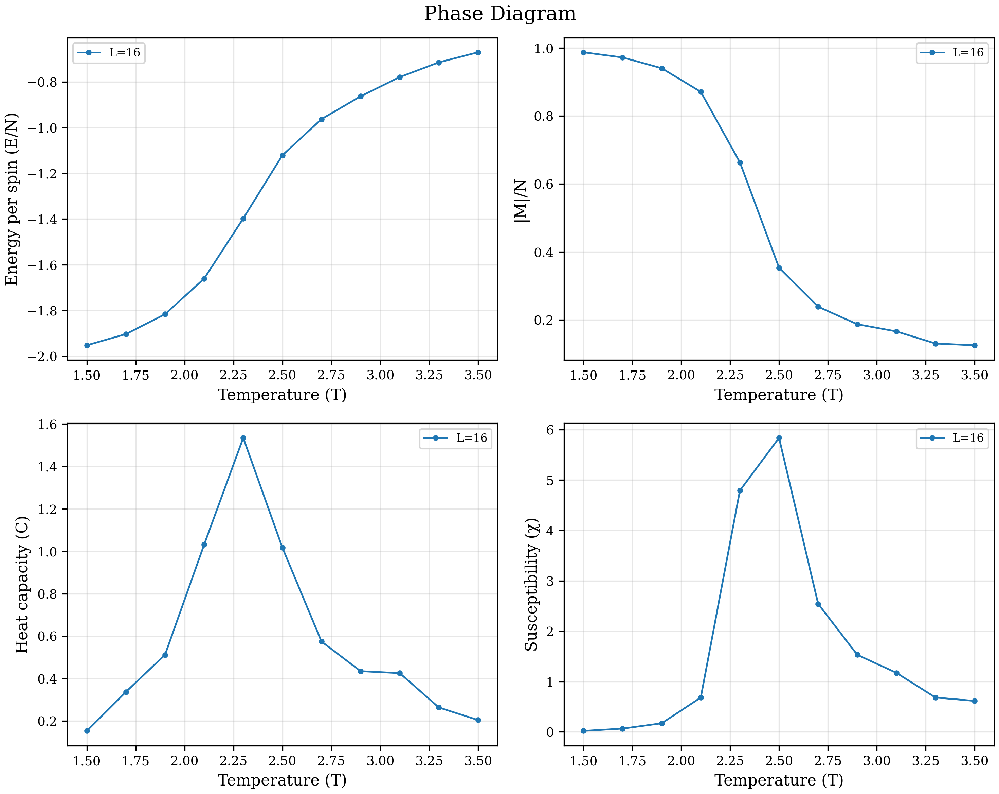
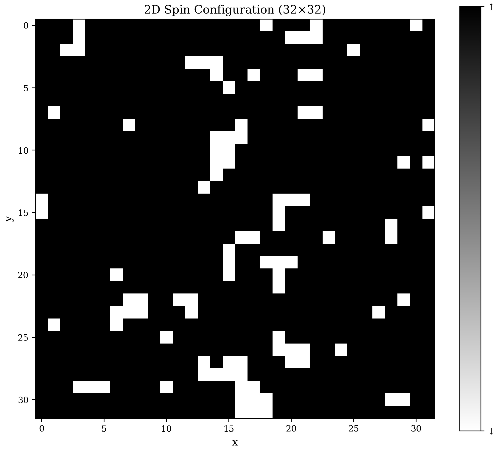
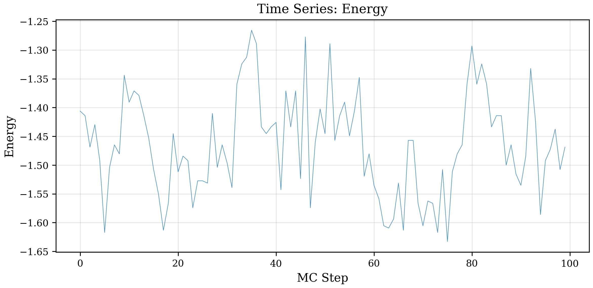
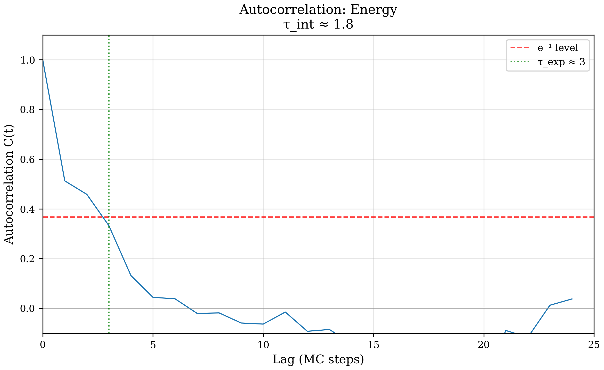
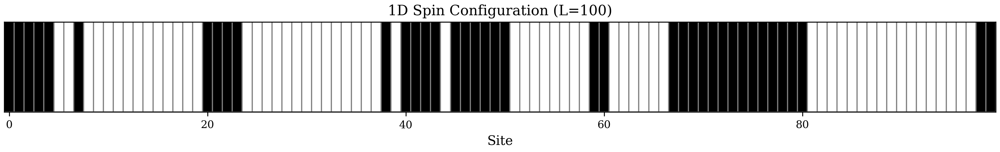
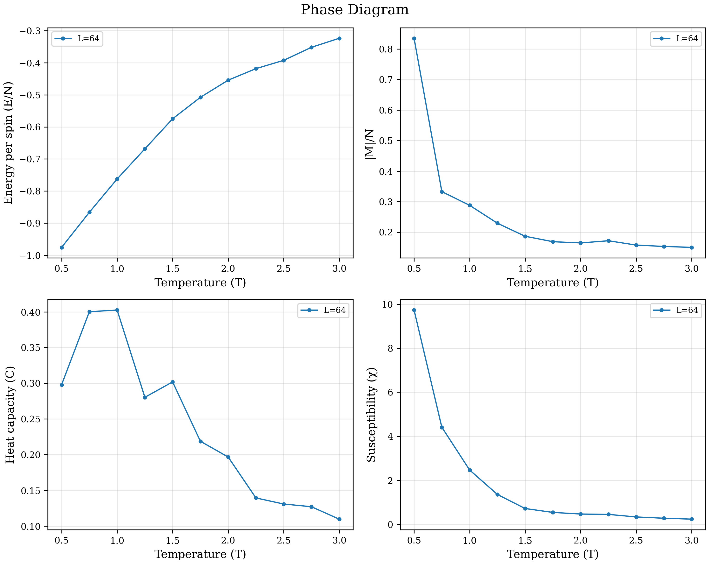
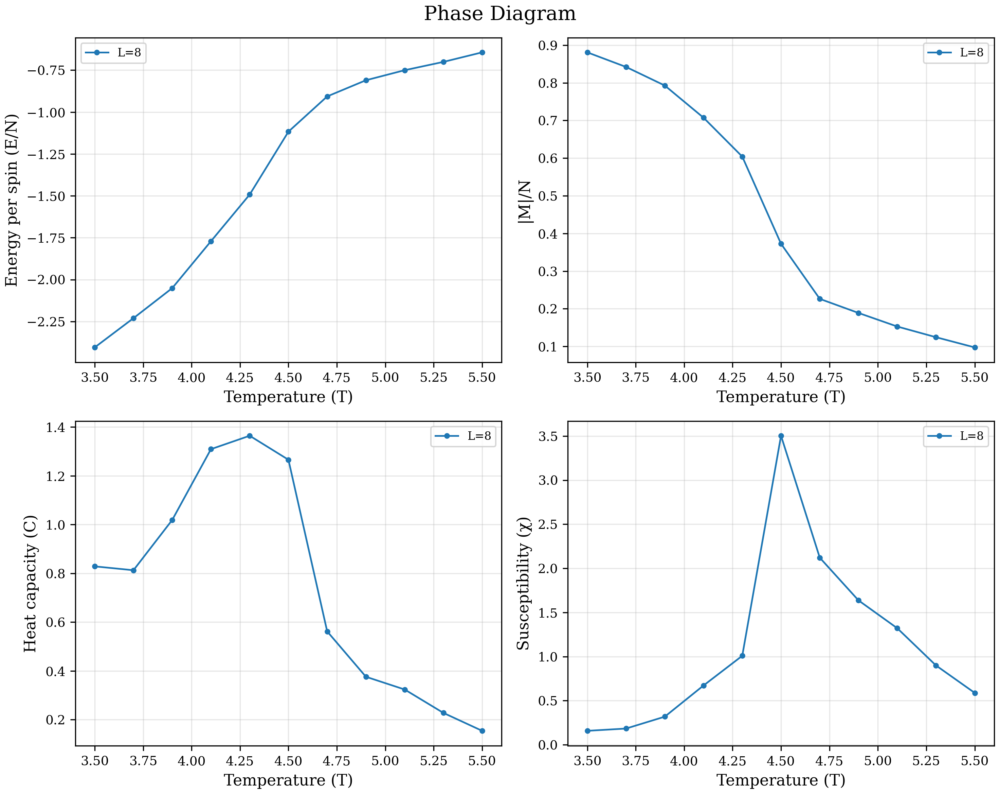

# Ising Monte Carlo Toolkit - Usage Guide

A comprehensive guide to using the Ising Monte Carlo simulation toolkit for studying magnetic phase transitions.

## Table of Contents

- [Quick Start](#quick-start)
- [CLI Commands](#cli-commands)
  - [run - Single Simulation](#run---single-simulation)
  - [sweep - Temperature Sweep](#sweep---temperature-sweep)
  - [plot - Visualization](#plot---visualization)
  - [analyze - Statistical Analysis](#analyze---statistical-analysis)
  - [info - Model Information](#info---model-information)
  - [benchmark - Performance Test](#benchmark---performance-test)
- [Example Workflows](#example-workflows)
- [Output Examples](#output-examples)
  - [2D Ising Model](#2d-ising-model-results)
  - [1D Ising Model](#1d-ising-model-results)
  - [3D Ising Model](#3d-ising-model-results)
- [Python API](#python-api)
- [Model Compatibility](#model-compatibility)

---

## Quick Start

### Installation

```bash
# Clone the repository
git clone https://github.com/yourusername/ising-monte-carlo-toolkit.git
cd ising-monte-carlo-toolkit

# Install dependencies
pip install -r requirements.txt
```

### Your First Simulation

Run a 2D Ising model simulation at the critical temperature:

```bash
python -m src.ising_toolkit.cli run -m ising2d -L 32 -T 2.269 -n 1000
```

**Output:**
```
Running ising2d simulation at T=2.2690...
Simulating  [####################################]  100%

==================================================
Simulation Results
==================================================
Model:            ising2d
Size:             32
Temperature:      2.2690
Algorithm:        metropolis
Steps:            1000
--------------------------------------------------
Energy/spin:      -1.464766 ± 0.087105
|Magnetization|:  0.727715 ± 0.087465
Heat capacity:    1.5091
Susceptibility:   3.4525
==================================================
```

---

## CLI Commands

### run - Single Simulation

Run a Monte Carlo simulation at a single temperature.

**Syntax:**
```bash
python -m src.ising_toolkit.cli run [OPTIONS]
```

**Options:**
| Option | Short | Description | Default |
|--------|-------|-------------|---------|
| `--model` | `-m` | Model type: `ising1d`, `ising2d`, `ising3d` | Required |
| `--size` | `-L` | Lattice size | Required |
| `--temperature` | `-T` | Temperature (units of J/kB) | Required |
| `--steps` | `-n` | Number of MC steps | 100000 |
| `--equilibration` | `-e` | Equilibration steps | 10000 |
| `--algorithm` | `-a` | `metropolis` or `wolff` | metropolis |
| `--output` | `-o` | Output file path (.npz) | None |
| `--save-spins` | | Save final spin configuration | False |
| `--seed` | `-s` | Random seed | None |

**Examples:**

```bash
# Basic 2D simulation
python -m src.ising_toolkit.cli run -m ising2d -L 32 -T 2.269

# With Wolff algorithm and save results
python -m src.ising_toolkit.cli run -m ising2d -L 64 -T 2.269 -a wolff -o results.npz

# Save spin configuration for visualization
python -m src.ising_toolkit.cli run -m ising2d -L 32 -T 2.269 --save-spins -o snapshot.npz

# 3D simulation
python -m src.ising_toolkit.cli run -m ising3d -L 16 -T 4.511 -n 5000
```

---

### sweep - Temperature Sweep

Run simulations across a range of temperatures to study phase transitions.

**Syntax:**
```bash
python -m src.ising_toolkit.cli sweep [OPTIONS]
```

**Options:**
| Option | Short | Description | Default |
|--------|-------|-------------|---------|
| `--model` | `-m` | Model type | Required |
| `--size` | `-L` | Lattice size(s) - can repeat | Required |
| `--temp-start` | | Start temperature | Required |
| `--temp-end` | | End temperature | Required |
| `--temp-steps` | | Number of temperature points | 50 |
| `--steps` | `-n` | MC steps per temperature | 100000 |
| `--algorithm` | `-a` | `metropolis` or `wolff` | metropolis |
| `--parallel` | `-p` | Number of parallel workers | 1 |
| `--output` | `-o` | Output directory | Required |
| `--format` | `-f` | Output format: `csv`, `npz`, `hdf5` | csv |

**Examples:**

```bash
# Basic sweep for phase diagram
python -m src.ising_toolkit.cli sweep -m ising2d -L 16 \
    --temp-start 1.5 --temp-end 3.5 --temp-steps 11 \
    --steps 2000 -o sweep_results/

# Multiple sizes for finite-size scaling
python -m src.ising_toolkit.cli sweep -m ising2d -L 16 -L 32 -L 64 \
    --temp-start 2.0 --temp-end 2.5 --temp-steps 20 \
    -o scaling_results/

# Parallel execution
python -m src.ising_toolkit.cli sweep -m ising2d -L 32 \
    --temp-start 1.5 --temp-end 3.5 -p 4 -o results/
```

**Output:**
```
============================================================
Temperature Sweep for Phase Diagram
============================================================
Model:         ising2d
Sizes:         [16]
T range:       [1.5, 3.5], 11 points
Algorithm:     metropolis
Steps:         2000 (equilibration: 10000)
============================================================

Processing L=16...
L=16  [####################################]  100%

============================================================
Sweep Complete!
============================================================

  Size    T_peak(χ)        χ_max    T_peak(C)        C_max
------------------------------------------------------------
    16       2.5000       5.8370       2.3000       1.5346
============================================================

Saved 2 files to sweep_results/
  - ising2d_L16_T1.50-3.50_metropolis.csv
  - sweep_summary_ising2d_metropolis.csv
```

---

### plot - Visualization

Generate various plots from simulation results.

**Syntax:**
```bash
python -m src.ising_toolkit.cli plot INPUT --type TYPE [OPTIONS]
```

**Plot Types:**
| Type | Description | Input Required |
|------|-------------|----------------|
| `phase_diagram` | Temperature dependence of observables | Sweep directory |
| `snapshot` | Spin configuration image | Single run with `--save-spins` |
| `timeseries` | Observable vs MC step | Single run |
| `autocorrelation` | Autocorrelation function | Single run |
| `binder` | Binder cumulant crossing | Multiple sizes |

**Options:**
| Option | Short | Description | Default |
|--------|-------|-------------|---------|
| `--type` | | Plot type (see above) | Required |
| `--observable` | `-O` | Observable for timeseries/autocorr | magnetization |
| `--output` | `-o` | Output file path | Auto-generated |
| `--format` | `-f` | `png`, `pdf`, `svg` | pdf |
| `--style` | `-s` | `publication`, `presentation`, `default` | publication |
| `--dpi` | | Resolution for raster formats | 300 |

**Examples:**

```bash
# Phase diagram from sweep results
python -m src.ising_toolkit.cli plot sweep_results/ \
    --type phase_diagram -f png -o phase_diagram.png

# Spin configuration snapshot
python -m src.ising_toolkit.cli plot snapshot.npz \
    --type snapshot -f png -o spins.png

# Energy time series
python -m src.ising_toolkit.cli plot results.npz \
    --type timeseries -O energy -f png -o energy_timeseries.png

# Autocorrelation analysis
python -m src.ising_toolkit.cli plot results.npz \
    --type autocorrelation -O energy -f png -o autocorr.png
```

---

### analyze - Statistical Analysis

Compute statistical analysis with bootstrap error estimates.

**Syntax:**
```bash
python -m src.ising_toolkit.cli analyze INPUT [OPTIONS]
```

**Options:**
| Option | Short | Description | Default |
|--------|-------|-------------|---------|
| `--observables` | `-O` | Comma-separated list or "all" | all |
| `--bootstrap` | `-b` | Bootstrap samples | 1000 |
| `--output` | `-o` | Save analysis to file | None |
| `--format` | `-f` | `csv`, `json`, `hdf5` | csv |

**Example:**

```bash
python -m src.ising_toolkit.cli analyze snapshot_run.npz
```

**Output:**
```
======================================================================
Analysis Results
======================================================================
Source: snapshot_run.npz
Model: ising2d
Size: 32
Temperature: 2.2690
Samples: 100
----------------------------------------------------------------------
Observable                   Mean          Std        Error
----------------------------------------------------------------------
energy                  -1.464766     0.087105     0.008958
magnetization            0.727715     0.087465     0.008698
======================================================================
```

---

### info - Model Information

Display theoretical information about a model.

**Example:**

```bash
python -m src.ising_toolkit.cli info --model ising2d
```

**Output:**
```
==================================================
Model Information: ising2d
==================================================

2D Ising Model (Square Lattice)
--------------------------------------------------
Critical temperature:  Tc = 2.269185 J/kB
                          = 2/ln(1+√2)

Critical exponents (exact):
  β  = 0.125000  (magnetization)
  γ  = 1.750000  (susceptibility)
  ν  = 1.000000  (correlation length)
  α  = 0.000000  (heat capacity, log divergence)

Exact solution: Onsager (1944)

==================================================
```

---

### benchmark - Performance Test

Compare algorithm performance.

**Example:**

```bash
python -m src.ising_toolkit.cli benchmark
```

**Output:**
```
==================================================
Performance Benchmark
==================================================

Temperature: T = 2.269 (critical)
Steps: 10000 per test

  Size   Metropolis (s)        Wolff (s)    Speedup
--------------------------------------------------
    16            0.404            2.547       0.16x
    32            0.315            8.379       0.04x
    64            1.281           29.123       0.04x
==================================================
```

---

## Example Workflows

### Workflow 1: Study Phase Transition

```bash
# Step 1: Run temperature sweep
python -m src.ising_toolkit.cli sweep -m ising2d -L 16 \
    --temp-start 1.5 --temp-end 3.5 --temp-steps 15 \
    --steps 5000 -o phase_study/

# Step 2: Generate phase diagram
python -m src.ising_toolkit.cli plot phase_study/ \
    --type phase_diagram -f png -o phase_diagram.png
```

### Workflow 2: Visualize Spin Configurations

```bash
# Run at different temperatures and save spins
python -m src.ising_toolkit.cli run -m ising2d -L 64 -T 1.5 \
    --save-spins -o low_temp.npz

python -m src.ising_toolkit.cli run -m ising2d -L 64 -T 2.269 \
    --save-spins -o critical_temp.npz

python -m src.ising_toolkit.cli run -m ising2d -L 64 -T 3.5 \
    --save-spins -o high_temp.npz

# Generate snapshots
python -m src.ising_toolkit.cli plot low_temp.npz --type snapshot -o low_temp.png
python -m src.ising_toolkit.cli plot critical_temp.npz --type snapshot -o critical_temp.png
python -m src.ising_toolkit.cli plot high_temp.npz --type snapshot -o high_temp.png
```

### Workflow 3: Autocorrelation Analysis

```bash
# Run longer simulation for better statistics
python -m src.ising_toolkit.cli run -m ising2d -L 32 -T 2.269 \
    -n 10000 -o long_run.npz

# Analyze autocorrelation
python -m src.ising_toolkit.cli plot long_run.npz \
    --type autocorrelation -O energy -o autocorr.png

# Get statistical summary
python -m src.ising_toolkit.cli analyze long_run.npz
```

---

## Output Examples

### 2D Ising Model Results

#### Phase Diagram

Shows how thermodynamic observables change with temperature:



**Interpretation:**
- **Energy**: Increases from ground state (-2) toward 0 as temperature increases
- **Magnetization**: Sharp drop from ~1 to ~0 at critical temperature
- **Heat Capacity**: Peak at Tc indicates phase transition
- **Susceptibility**: Diverges at Tc (peaks sharply)

---

### Spin Configuration Snapshot

Visualizes the spin lattice at a given temperature:



**Interpretation:**
- **Black pixels**: Spin down (↓ or -1)
- **White pixels**: Spin up (↑ or +1)
- At T < Tc: Mostly uniform (ordered phase)
- At T ≈ Tc: Large clusters of both orientations
- At T > Tc: Random pattern (disordered phase)

---

### Energy Time Series

Shows energy fluctuations during simulation:



**Interpretation:**
- Large fluctuations near Tc indicate critical slowing down
- Equilibration is visible if early values differ significantly

---

### Autocorrelation Function

Measures how correlated consecutive measurements are:



**Interpretation:**
- **τ_int** (integrated autocorrelation time): ~1.8 MC steps
- **τ_exp** (exponential decay time): ~3 MC steps
- Longer correlation times mean fewer independent samples

---

### 1D Ising Model Results

The 1D Ising model has **no phase transition at finite temperature** — the system is paramagnetic for all T > 0.

#### 1D Model Info

```bash
python -m src.ising_toolkit.cli info --model ising1d
```

```
==================================================
Model Information: ising1d
==================================================

1D Ising Model
--------------------------------------------------
No phase transition at finite temperature.
The system is paramagnetic for all T > 0.

Ground state energy: E/N = -J
Exact solution: Ising (1925)

==================================================
```

#### 1D Simulation

```bash
python -m src.ising_toolkit.cli run -m ising1d -L 100 -T 1.5 -n 2000 --save-spins -o ising1d_run.npz
```

```
==================================================
Simulation Results
==================================================
Model:            ising1d
Size:             100
Temperature:      1.5000
Algorithm:        metropolis
Steps:            2000
--------------------------------------------------
Energy/spin:      -0.582400 ± 0.077216
|Magnetization|:  0.150600 ± 0.111945
Heat capacity:    0.2650
Susceptibility:   0.8354
==================================================
```

> **Note:** The Wolff algorithm is **not supported** for 1D models. Use `-a metropolis` (the default). Attempting `-a wolff` with a 1D model will show a friendly error message suggesting Metropolis instead.

#### 1D Spin Snapshot

```bash
python -m src.ising_toolkit.cli plot ising1d_run.npz --type snapshot -f png -o ising1d_snapshot.png
```



**Interpretation:**
- The 1D snapshot displays as a horizontal bar showing each spin along the chain
- Black = spin down (-1), White = spin up (+1)
- At finite T, you see a mix of small aligned domains (no long-range order)

#### 1D Phase Diagram (Temperature Sweep)

```bash
# Run sweep
python -m src.ising_toolkit.cli sweep -m ising1d -L 64 \
    --temp-start 0.5 --temp-end 3.0 --temp-steps 11 \
    --steps 2000 -o ising1d_sweep/

# Plot
python -m src.ising_toolkit.cli plot ising1d_sweep/ \
    --type phase_diagram -f png -o ising1d_phase_diagram.png
```



**Interpretation:**
- **No sharp transition** — magnetization decreases gradually with temperature
- **Susceptibility peaks at low T** (χ_max at T≈0.5) but doesn't diverge
- **Heat capacity** has a broad maximum around T≈1.0 (Schottky anomaly)
- Compare with 2D: the 2D model shows sharp peaks/transitions; 1D does not

#### 1D Analysis

```bash
python -m src.ising_toolkit.cli analyze ising1d_run.npz
```

```
======================================================================
Analysis Results
======================================================================
Source: ising1d_run.npz
Model: ising1d
Size: 100
Temperature: 1.5000
Samples: 200
----------------------------------------------------------------------
Observable                   Mean          Std        Error
----------------------------------------------------------------------
energy                  -0.582400     0.077216     0.005540
magnetization            0.150600     0.111945     0.007777
======================================================================
```

---

### 3D Ising Model Results

The 3D Ising model has a phase transition at **Tc ≈ 4.511 J/kB** (no exact analytical solution).

#### 3D Model Info

```bash
python -m src.ising_toolkit.cli info --model ising3d
```

```
==================================================
Model Information: ising3d
==================================================

3D Ising Model (Cubic Lattice)
--------------------------------------------------
Critical temperature:  Tc ≈ 4.511000 J/kB

Critical exponents (numerical):
  β  ≈ 0.326000  (magnetization)
  γ  ≈ 1.237000  (susceptibility)
  ν  ≈ 0.630000  (correlation length)

No exact solution known.

==================================================
```

#### 3D Simulation

```bash
# Metropolis algorithm
python -m src.ising_toolkit.cli run -m ising3d -L 10 -T 4.511 -n 1000 --save-spins -o ising3d_run.npz

# Wolff algorithm (supported for 3D)
python -m src.ising_toolkit.cli run -m ising3d -L 10 -T 4.511 -n 1000 -a wolff -o ising3d_wolff.npz
```

```
==================================================
Simulation Results
==================================================
Model:            ising3d
Size:             10
Temperature:      4.5110
Algorithm:        metropolis
Steps:            1000
--------------------------------------------------
Energy/spin:      -1.089360 ± 0.189763
|Magnetization|:  0.346940 ± 0.163790
Heat capacity:    1.7696
Susceptibility:   5.9471
==================================================
```

> **Note:** 3D lattices have N³ spins, so they are much more computationally expensive. Use smaller sizes (L=8-16) compared to 2D (L=32-64).

#### 3D Spin Snapshot

The 3D snapshot shows **cross-sectional slices** through the cubic lattice at different z-depths:

```bash
python -m src.ising_toolkit.cli plot ising3d_run.npz --type snapshot -f png -o ising3d_snapshot.png
```


**Interpretation:**
- Shows 4 slices at z=0, z=3, z=6, z=9 through the 10×10×10 cube
- Black = spin down (-1), White = spin up (+1)
- At T ≈ Tc: large domains of mixed orientation visible across slices
- Compare with 2D: similar domain structure but now in a 3D volume

#### 3D Phase Diagram (Temperature Sweep)

```bash
# Run sweep
python -m src.ising_toolkit.cli sweep -m ising3d -L 8 \
    --temp-start 3.5 --temp-end 5.5 --temp-steps 11 \
    --steps 1000 -o ising3d_sweep/

# Plot
python -m src.ising_toolkit.cli plot ising3d_sweep/ \
    --type phase_diagram -f png -o ising3d_phase_diagram.png
```



**Interpretation:**
- **Magnetization**: Sharp drop from ~0.9 to ~0.1 around T ≈ 4.3-4.5, consistent with Tc ≈ 4.511
- **Susceptibility**: Peaks at T ≈ 4.5, signaling the phase transition
- **Heat capacity**: Peaks at T ≈ 4.3, close to Tc
- **Energy**: Smooth increase from ordered (-2.4) to disordered (-0.7) state
- Compare with 2D (Tc ≈ 2.27): 3D has a higher critical temperature because each spin has 6 neighbors instead of 4

#### 3D Analysis

```bash
python -m src.ising_toolkit.cli analyze ising3d_run.npz
```

```
======================================================================
Analysis Results
======================================================================
Source: ising3d_run.npz
Model: ising3d
Size: 10
Temperature: 4.5110
Samples: 100
----------------------------------------------------------------------
Observable                   Mean          Std        Error
----------------------------------------------------------------------
energy                  -1.089360     0.189763     0.018577
magnetization            0.346940     0.163790     0.016272
======================================================================
```

---

## Python API

For advanced usage, you can use the Python API directly:

```python
from src.ising_toolkit.models import Ising2D
from src.ising_toolkit.samplers import MetropolisSampler, WolffSampler
import numpy as np

# Create model
model = Ising2D(size=32, temperature=2.269, use_numba=True)

# Create sampler
sampler = MetropolisSampler(model)

# Equilibrate
for _ in range(1000):
    sampler.step()

# Collect measurements
energies = []
magnetizations = []

for _ in range(5000):
    sampler.step()
    energies.append(model.get_energy() / model.n_spins)
    magnetizations.append(np.abs(model.get_magnetization()) / model.n_spins)

# Compute statistics
print(f"Energy: {np.mean(energies):.4f} ± {np.std(energies):.4f}")
print(f"Magnetization: {np.mean(magnetizations):.4f} ± {np.std(magnetizations):.4f}")
```

### Temperature Sweep with Python

```python
from src.ising_toolkit.analysis import TemperatureSweep

# Configure sweep
sweep = TemperatureSweep(
    model_class='Ising2D',
    size=32,
    temperatures=np.linspace(1.5, 3.5, 20),
    n_steps=5000,
    n_equilibration=1000,
)

# Run (with parallel execution)
results = sweep.run(n_workers=4)

# Access results
print(f"Critical temperature estimate: {results.estimate_tc():.4f}")
```

---

## Physical Background

### The Ising Model

The Ising model describes a lattice of spins (σᵢ = ±1) with nearest-neighbor interactions:

```
H = -J Σ σᵢσⱼ
```

where J > 0 is the ferromagnetic coupling constant.

### Critical Temperatures

| Model | Tc (J/kB) | Notes |
|-------|-----------|-------|
| 1D | 0 | No phase transition |
| 2D (square) | 2.269185... | Exact: 2/ln(1+√2) |
| 3D (cubic) | ~4.511 | Numerical estimate |

### Observables

- **Energy (E)**: Total interaction energy
- **Magnetization (M)**: Net spin alignment
- **Heat Capacity (C)**: C = (1/T²) × Var(E) × N
- **Susceptibility (χ)**: χ = (1/T) × Var(M) × N

---

## Model Compatibility

Not all features are available for every model. Here's the full compatibility matrix:

| Feature | 1D (`ising1d`) | 2D (`ising2d`) | 3D (`ising3d`) |
|---------|:-:|:-:|:-:|
| `run` (Metropolis) | ✅ | ✅ | ✅ |
| `run` (Wolff) | ❌ | ✅ | ✅ |
| `sweep` | ✅ | ✅ | ✅ |
| `plot phase_diagram` | ✅ | ✅ | ✅ |
| `plot snapshot` | ✅ (bar) | ✅ (heatmap) | ✅ (slices) |
| `plot timeseries` | ✅ | ✅ | ✅ |
| `plot autocorrelation` | ✅ | ✅ | ✅ |
| `plot animation` | ❌ | ✅ | ❌ |
| `analyze` | ✅ | ✅ | ✅ |
| `info` | ✅ | ✅ | ✅ |
| `benchmark` | ❌ | ✅ | ❌ |

**Key limitations:**
- **Wolff algorithm** requires 2D or 3D models (cluster flipping needs ≥2 dimensions)
- **Animation** is currently only implemented for 2D models
- **Benchmark** compares Metropolis vs Wolff, so only works with 2D

---

## Troubleshooting

### Common Issues

1. **Empty plots**: Ensure sweep data uses correct format (run `sweep` command first)
2. **"Wolff algorithm not supported"**: Wolff requires 2D or 3D models. Use `-a metropolis` for 1D
3. **Slow performance**: Enable Numba with `use_numba=True` in Python API
4. **Memory issues**: Use smaller lattice sizes or reduce number of steps

### Getting Help

```bash
# General help
python -m src.ising_toolkit.cli --help

# Command-specific help
python -m src.ising_toolkit.cli run --help
python -m src.ising_toolkit.cli sweep --help
python -m src.ising_toolkit.cli plot --help
```

---

## References

1. Onsager, L. (1944). Crystal Statistics. Physical Review, 65(3-4), 117.
2. Metropolis, N. et al. (1953). Equation of State Calculations. J. Chem. Phys., 21, 1087.
3. Wolff, U. (1989). Collective Monte Carlo Updating. Phys. Rev. Lett., 62, 361.
